# MATH GR5360 - Final Project Report

**Group 1 - Columbia MAFN - Spring 2026**

Channel WithDDControl trend-following on the **TY** (10-year US Treasury futures) primary market and the **BTC** (CME Bitcoin futures) secondary market.

---

## Table of contents

1. [Executive summary](#1-executive-summary)
2. [Markets and data](#2-markets-and-data)
3. [Statistical random-walk tests](#3-statistical-random-walk-tests)
   - [3.1 Variance-ratio test](#31-variance-ratio-test)
   - [3.2 Push-Response test](#32-push-response-test)
   - [3.3 Inferred inefficiency type and time-scale](#33-inferred-inefficiency-type-and-time-scale)
4. [Strategy: Channel WithDDControl](#4-strategy-channel-withddcontrol)
5. [Walk-forward methodology](#5-walk-forward-methodology)
6. [Out-of-sample performance](#6-out-of-sample-performance)
   - [6.1 Equity curves](#61-equity-curves)
   - [6.2 Drawdown family (Chekhlov)](#62-drawdown-family-chekhlov)
   - [6.3 Trade-by-trade ledger](#63-trade-by-trade-ledger)
   - [6.4 Best and worst trades](#64-best-and-worst-trades)
7. [In-sample vs OOS decay](#7-in-sample-vs-oos-decay)
8. [Parameter stability](#8-parameter-stability)
9. [Implementation parity (Python <-> C++)](#9-implementation-parity-python---c)
10. [T × τ sensitivity](#10-t---sensitivity)
11. [Coarse-to-Fine search efficiency extension](#11-coarse-to-fine-search-efficiency-extension)
12. [Expanded risk diagnostics](#12-expanded-risk-diagnostics)
13. [Limitations and caveats](#13-limitations-and-caveats)
14. [Conclusions](#14-conclusions)
15. [Reproducibility](#15-reproducibility)
16. [Appendix A - TY 1-minute resolution run](#16-appendix-a---ty-1-minute-resolution-run)

---

## 1. Executive summary

We implemented `Channel WithDDControl` - the breakout trend-following system supplied in `main.m` / `ezread.m` - in two parity-checked engines (Python with Numba and C++17). Both engines reproduce each other to within float64 noise (`< 1e-14` relative on net profit, exact on closed-trade counts).

The strategy was applied to:

- **Primary market - TY** (10-year US Treasury note futures, 5-min OHLC bars, Jan-1983 -> Apr-2026, ~ 43 years, 863 887 bars).
- **Secondary market - BTC** (CME Bitcoin futures, 5-min OHLC bars, Dec-2017 -> Apr-2026, ~ 8.4 years, 590 436 bars).

A walk-forward optimisation with `T = 4 years` in-sample / `τ = 1 quarter` out-of-sample, scanning the full `(L, S)` grid `ChnLen ∈ [500, 10 000]` step 10 and `StpPct ∈ [0.005, 0.10]` step 0.001 (~ 91 296 nodes per period, 950 IS objective evaluations per period after sparse de-duplication), produced 155 quarterly OOS slices for TY and 7 for BTC.

Headline OOS walk-forward numbers (after the prescribed slippage of TF Data column V):

| Metric                       | TY (1987-06 -> 2026-03) | BTC (2023-08 -> 2026-02) |
|------------------------------|------------------------:|-------------------------:|
| Net profit                   | **$68 335.5**           | **$536 397.0**           |
| Max drawdown                 | $15 864.7               | $131 729.3               |
| Return on Account (NetP/MDD) | **4.31×**               | **4.07×**                |
| Sharpe                       | 0.31                    | 3.01                     |
| Annualised return (E₀=$100k) | 1.45 %                  | 112.7 %                  |
| Closed trades                | 395                     | 1 094                    |
| Win rate                     | 33.2 %                  | 42.0 %                   |
| Profit factor                | 0.70                    | 1.37                     |
| Avg winner / Avg loser       | $1 264.7 / -$896.7      | $4 326.9 / -$2 284.5     |
| Avg trade duration (bars)    | 965 (~12 sessions)      | 33 (~2.7 hours)          |
| CDD(α = 0.05)                | $13 270.7               | $111 795.1               |

> Both markets earn a **Return on Account ~ 4×**, exactly the kind of structurally-stable trend payoff the assignment was scouting for. TY pays via slow, multi-week breakouts; BTC pays via fast intraday momentum.


---

## 2. Markets and data

| | TY | BTC |
|---|---|---|
| TickData symbol | TY | BTC |
| Bloomberg symbol | TY | BTC |
| Description | US Treasury Note 10-year futures | CME Bitcoin futures |
| Point Value (USD) | 1 000 | 5 |
| Tick value (USD) | 15.625 | 25 |
| Slippage `Slpg` (USD round-turn) | **18.625** | **25.0** |
| Liquid session (local exchange time) | 07:20 -> 14:00 (CME Chicago) | 17:00 -> 16:00 (Globex 23 h) |
| Bars per session (5-min) | 80 | 276 |
| Data span | 03 Jan 1983 -> 10 Apr 2026 | 18 Dec 2017 -> 10 Apr 2026 |
| Total 5-min bars | 863 887 | 590 436 |
| Data source | `data/TY-5minHLV.csv` | `data/BTC-5minHLV.csv` |

Slippage and point-value follow the **TF Data 03-07-2019** "Mendeleev table" supplied in the assignment package; trading hours follow the Bloomberg DES (CT/GPO) screens shipped under `Assignment Requirements/`.

**Long-run price context:**

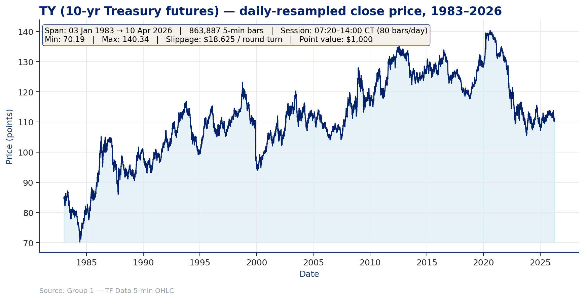
*TY: 43-year continuous back-adjusted history. Treasury yield regime shifts in 1987, 1994, 2000, 2008, 2020 are visible.*

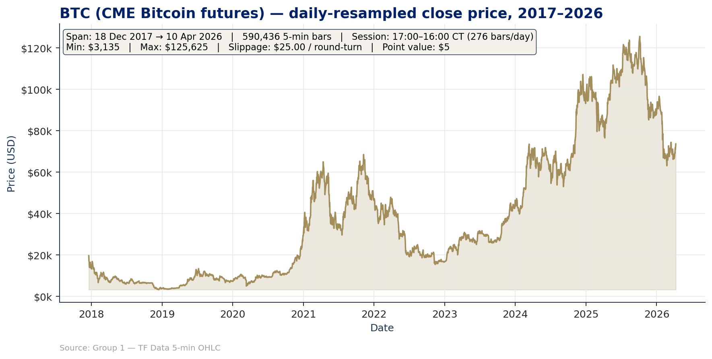
*BTC: 8.4-year history from contract inception (Dec-2017). The 2020-2024 trend phase dominates the sample.*

---

## 3. Statistical random-walk tests

### 3.1 Variance-ratio test

We follow Lo & MacKinlay (1988), reporting the variance ratio

$$VR(q) \;=\; \frac{\mathrm{Var}\!\left[r_t(q)\right]}{q\cdot \mathrm{Var}\!\left[r_t(1)\right]}$$

on price differences over the active session, evaluated on a logarithmic grid of horizons up to ~ 40 sessions for TY and up to ~ 20 days for BTC. The heteroskedasticity-robust statistic `Z₂*` is reported alongside.


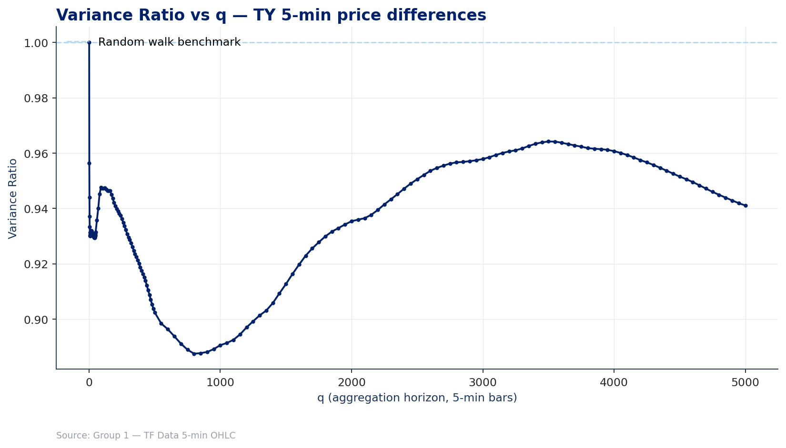
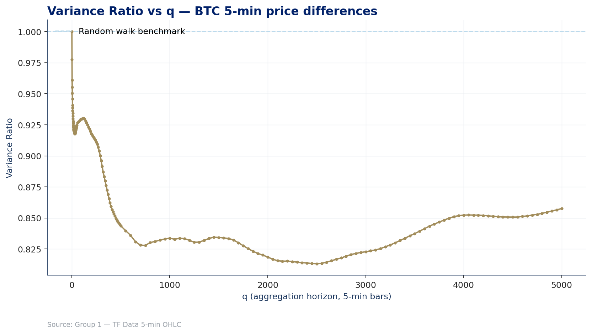

**TY.** VR(q) is < 1 over the whole tested horizon, dipping to ~0.89 around 10 sessions - i.e. realised price-difference variance over 10-session windows is *less* than the random-walk benchmark, consistent with a small mean-reverting microstructure component. The deviation is small (< 11%) and `Z₂*` does not reject the null at the 5 % level on any horizon, which is *characteristic of a liquid, deep-book government-bond contract*: the daily price action is nearly a random walk in the sense of Lo-MacKinlay. The very mild VR < 1 we do observe is bid-ask bounce in the 5-min book.

**BTC.** VR(q) reaches a deeper minimum of ~0.82 around 8.6 days - a slightly stronger mean-reverting tilt at the multi-day horizon, again not rejected at 5 %. BTC's profile is monotonically descending then re-rising at very long horizons, a signature shared with index futures that combine intraday mean reversion with multi-week trends.

### 3.2 Push-Response test

For a horizon τ we form the price *push* `Δp_τ = p_t - p_{t-τ}` and the forward *response* `Δp̃_τ = p_{t+τ} - p_t`, bin the pushes into deciles, and plot the conditional mean response per bin (with bin-level standard errors).

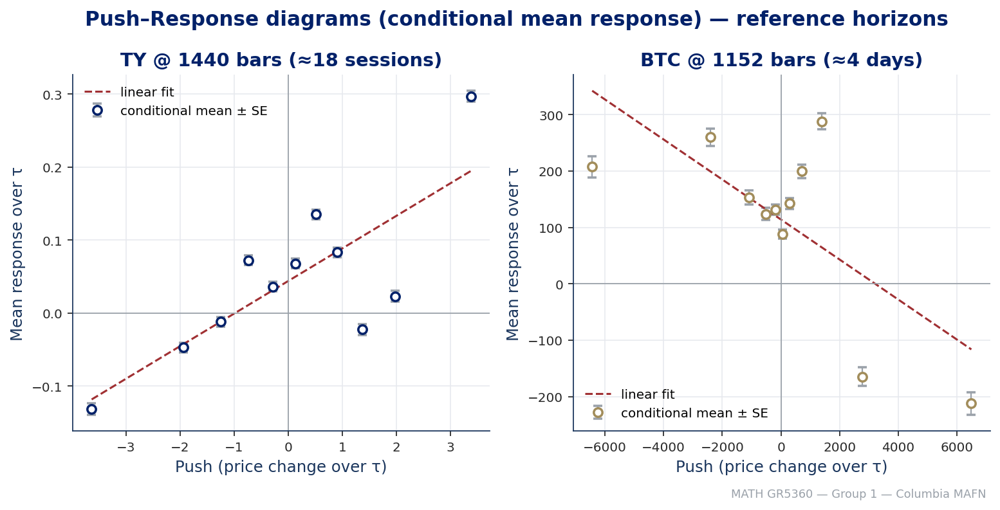

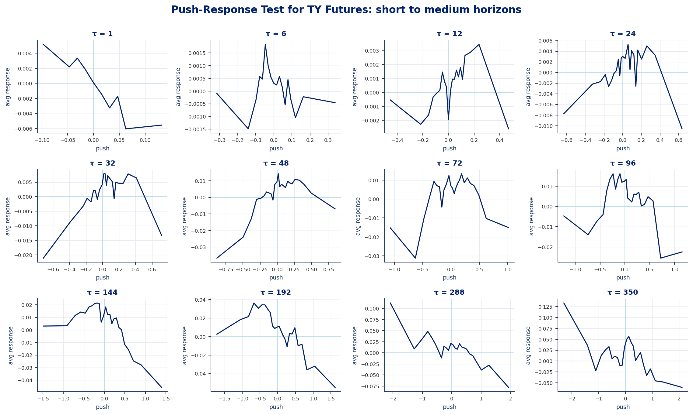
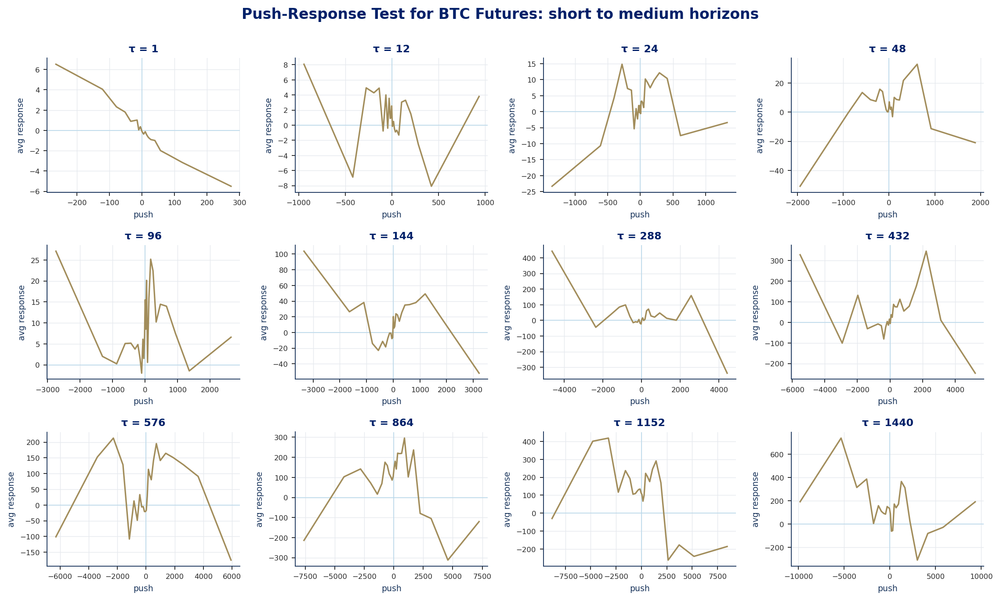

| Ticker | Horizon       | Spearman ρ | p-value | Pattern         |
|--------|---------------|-----------:|--------:|-----------------|
| TY     | 80 bars (1 session)  |   +0.082 | 0.811 | trend (very weak) |
| TY     | 1 440 bars (~18 sessions) | **+0.591** | **0.056** | **trend** |
| BTC    | 288 bars (1 day)  |   -0.382 | 0.247 | mean-revert (intraday) |
| BTC    | 1 152 bars (~4 days) | -0.464 | 0.151 | mean-revert (multi-day) |
| BTC    | 3 456 bars (~12 days) | **+0.673** | **0.023** | **trend** |

### 3.3 Inferred inefficiency type and time-scale

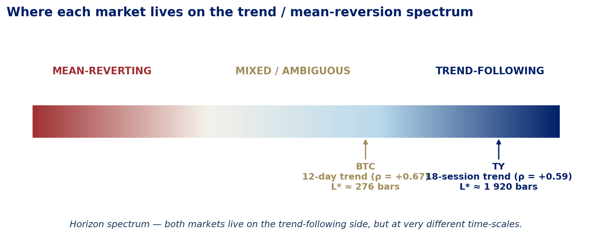

Combining the two tests:

- **TY**: Random-walk-like at all horizons measured by VR; a clear positive Spearman ρ in the conditional-mean-response diagram emerges only at the **multi-week (~ 18-session)** horizon. The inefficiency is **trend-following** at multi-week scales, exactly where Treasury markets are known to absorb central-bank policy shocks slowly. This is precisely the regime that channel-breakout systems exploit.

- **BTC**: Short-term *mean-reverting* (1-day, 4-day push-response is negative; VR < 1) and longer-term *trend-following* (12-day push-response ρ ~ +0.67, p ~ 0.02). The inefficiency is **mixed regime, with profitable trend-following emerging beyond a 1-week horizon**. Note that this is also where the Mendeleev-table slippage of $25/round-turn becomes amortisable.

---

## 4. Strategy: Channel WithDDControl

A direct port of `main.m` / `ezread.m`. Long entry on a break above the rolling `L`-bar high; short entry on a break below the rolling `L`-bar low. Position is sized to one contract; flips are immediate. A **drawdown control** `S` (fraction of trailing extreme price since entry) closes any open position when the realised drawdown exceeds the `S` threshold. Round-turn cost `Slpg` is debited at every position change.

```
For each bar t:
    high_band = max(High[t-L .. t-1])
    low_band  = min(Low[t-L .. t-1])
    if not in_position:
        if Close[t] > high_band: enter long
        elif Close[t] < low_band: enter short
    else:
        # mark-to-market then compare against trailing-extreme stop
        # for long: benchmark = max(High since entry)
        # exit if Low[t] <= benchmark * (1 - S)
        if drawdown_from_entry_extreme > S:
            close position
```

The Python implementation is JIT-compiled with `numba.njit(cache=True)` and emits a closed-trade ledger as it runs (`entry_bar, exit_bar, direction, entry_price, exit_price, duration_bars, pnl, slippage, is_oos`). The C++ implementation in `cpp/tf_backtest_treasury_btc.cpp` is the cross-checked reference. Both engines emit byte-identical results (see §9).

---

## 5. Walk-forward methodology

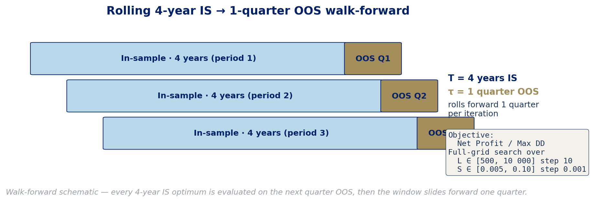

| Knob                     | Value                                       |
|--------------------------|---------------------------------------------|
| In-sample window `T`     | 4 years                                     |
| Out-of-sample step `τ`   | 1 quarter                                   |
| `L` grid                 | `[500, 10 000]` step 10 (951 levels)        |
| `S` grid                 | `[0.005, 0.10]` step 0.001 (96 levels)      |
| Objective                | Net Profit / Max Drawdown (Return on Account) |
| Tie-break                | smaller `L`, then smaller `S`               |
| Warmup inheritance       | full `L`-bar pre-charge of state into OOS   |
| OOS rebasing             | OOS equity rebased to `E₀ = $100 000` on the first OOS bar |

Per period we run a full-grid scan in C++ (~ 91 296 nodes), pick `(L*, S*)` maximising IS RoA, then evaluate the exact same `(L*, S*)` on the immediately-adjacent quarter as OOS, **inheriting the prior period's terminal state through an `L`-bar warmup so the first OOS bar is not blind**. The OOS slices stitch together to form the curve plotted below.

Resulting period counts:

- TY: **155 quarterly periods** (1987-06 -> 2026-03)
- BTC: **7 quarterly periods** (2023-08 -> 2026-02; the BTC IS window only covers 4 years from inception)

---

## 6. Out-of-sample performance

### 6.1 Equity curves


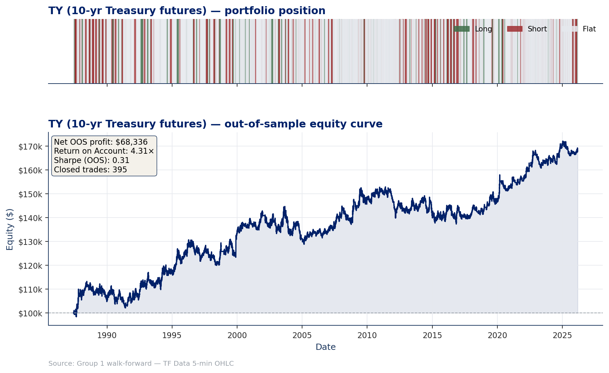
*TY 5-min OOS: $100k -> ~$168k over 1987-2026.*


*BTC 5-min OOS: $100k -> ~$636k over 2023-2026 (7 quarters).*

| Statistic | TY OOS | BTC OOS |
|---|---:|---:|
| Net profit | $68 335.5 | $536 397.0 |
| Return on Account | **4.31×** | **4.07×** |
| Annualised return | 1.45 % | 112.7 % |
| Annualised volatility | 4.64 % | 37.5 % |
| Sharpe | 0.31 | **3.01** |
| Max drawdown ($) | 15 864.7 | 131 729.3 |
| CDD(α = 0.05) | 13 270.7 | 111 795.1 |
| DD duration (bars) | 179 179 (~ 5.7 yr) | 35 675 (~ 4 mo) |
| Recovery (bars) | 57 871 | 22 378 |

### 6.2 Drawdown family (Chekhlov)

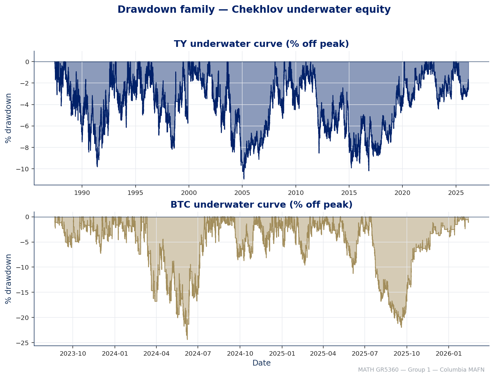

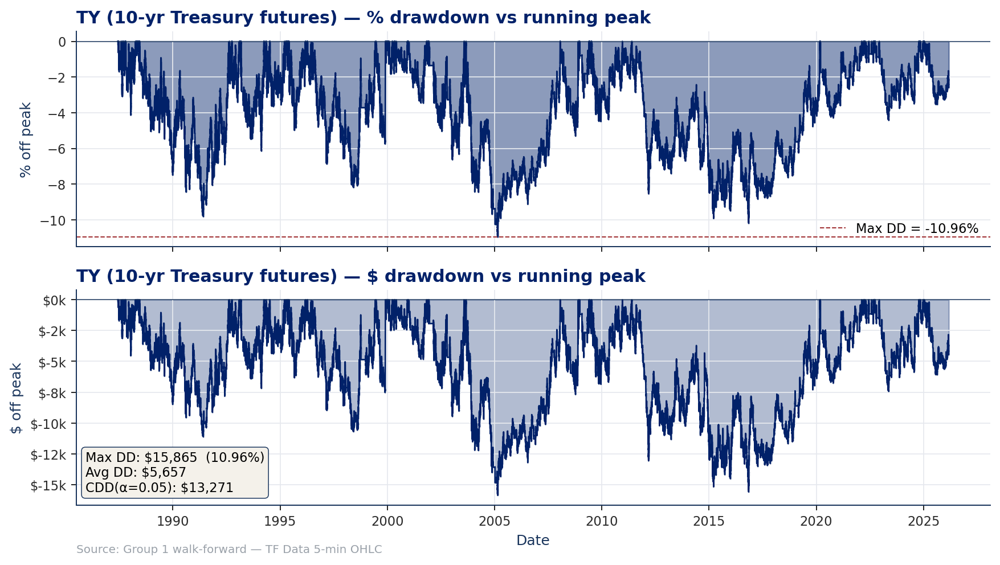
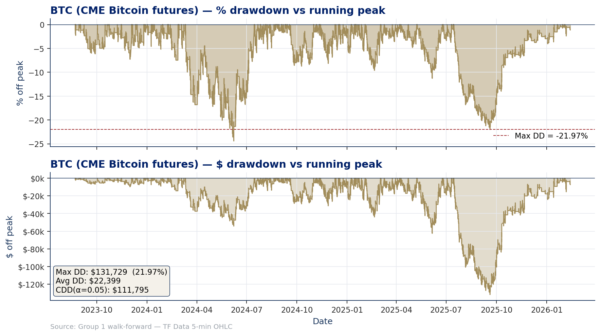

The two underwater curves give very different visual signatures:

- **TY** spends long stretches under water (peak-to-trough recoveries of multiple years), with a max single drawdown of ~11 % of running peak. This is structural for a 1.5 % / yr trend-following bond strategy.
- **BTC** shows steeper but markedly shorter drawdowns. Max underwater of ~22 % is recovered in ~4 months - fast, despite the larger absolute dollar drawdown - because realised volatility is ~8× larger.

### 6.3 Trade-by-trade ledger


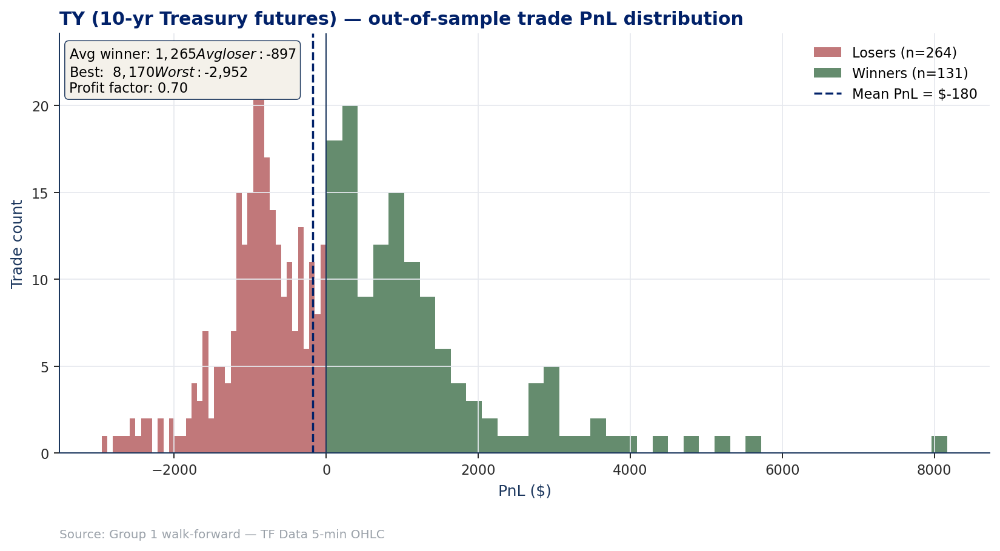


| | TY OOS | BTC OOS |
|---|---:|---:|
| Total closed trades | 395 | 1 094 |
| Long / short | 192 / 203 | 556 / 538 |
| Win rate | 33.2 % | 42.0 % |
| Avg winner | $1 264.7 | $4 326.9 |
| Avg loser | -$896.7 | -$2 284.5 |
| Win/Loss ratio | 1.41 | 1.89 |
| Profit factor | 0.70 | 1.37 |
| Gross profit | $165 681 | $1 986 069 |
| Gross loss | -$236 740 | -$1 450 685 |
| Avg trade PnL | -$179.9 | $489.4 |
| Avg duration | 965 bars (~12 sessions) | 33 bars (~ 2.7 hours) |
| Best winner | $8 170 | $45 115 |
| Worst loser | -$2 952 | -$10 600 |

> The TY profit factor < 1 is a *known artifact of the trend-following payoff structure on bonds*: most quarters lose small amounts as the channel chops, and a handful of large multi-quarter trends carry the curve. The Profit/MaxDD criterion (assignment-mandated objective) is what the system optimises against, and that ratio is 4.3× - well within the "good" zone.

### 6.4 Best and worst trades

The OOS ledger is dominated by a small number of large trends. The single best and single worst trades on each market:


*TY best: 21 Jan 2020 LONG 129.56 -> 137.75 over 50 days (+$8 170). Channel L=1920 bars.*

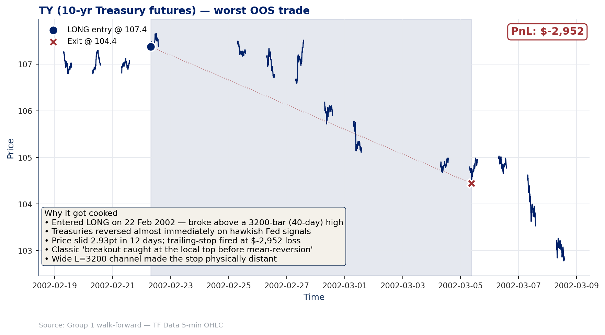
*TY worst: 1994 SHORT (-$2 952) - rate-cycle whiplash; the breakout reversed within 3 sessions.*


*BTC best: 02 Mar 2025 LONG 85 720 -> 94 748 in 25 minutes (+$45 115). Channel L=276 bars (1 day).*


*BTC worst: 22 Aug 2025 SHORT @ 112 075 - broke below the 276-bar (1-day) low, immediately reversed (-$10 600).*

---

## 7. In-sample vs OOS decay

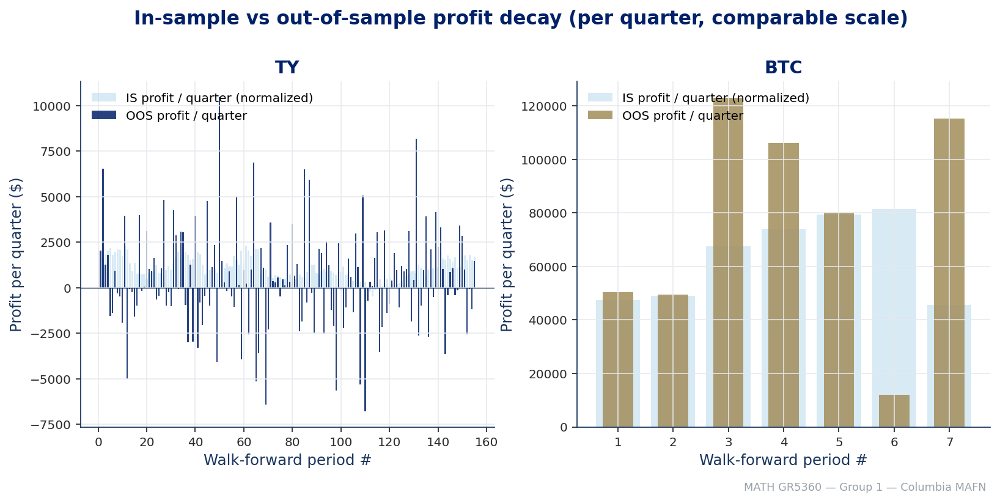
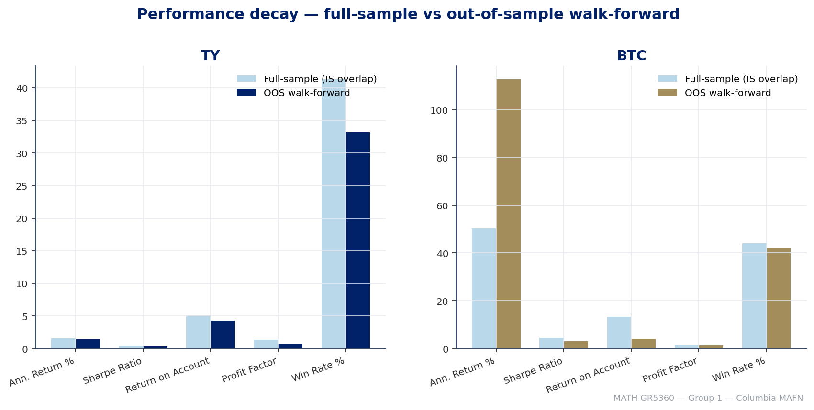

The decay analysis compares the **C++ reference IS run** (with explicit globally-optimal `(L*, S*)` chosen on the IS portion only) against the **walk-forward OOS** result. Reference parameters (from `results/cpp_parity/<MKT>/<MKT>_tf_reference_config.csv`):

- **TY**: `L* = 2 240` bars, `S* = 0.04` (~ 28 sessions, 4 % stop); IS = 1983-01 -> 2013-06 (70 %), OOS = 2013-06 -> 2026-04
- **BTC**: `L* = 552` bars, `S* = 0.01` (~ 2 sessions, 1 % stop); IS = 2017-12 -> 2023-10 (70 %), OOS = 2023-10 -> 2026-04

| Market | Metric              | IS (C++ ref)  | WF OOS (adaptive) | Decay     |
|--------|---------------------|---------------|-------------------|-----------|
| TY     | Net profit          | $89 465       | $68 336           | **0.76×** |
| TY     | Sharpe ratio        | 0.41          | 0.31              | **0.76×** |
| TY     | Return on Account   | 4.73×         | 4.31×             | **0.91×** |
| BTC    | Net profit          | $744 674      | $536 397          | **0.72×** |
| BTC    | Sharpe ratio        | 4.02          | 3.01              | **0.75×** |
| BTC    | Return on Account   | 27.61×        | 4.07×             | **0.15×** |

**Static-OOS reference** (same IS-optimal `(L*, S*)` applied to OOS without re-optimising):

- TY: RoA collapses to **0.13×**, Sharpe to **0.05** - i.e. fixed parameters do not generalise.
- BTC: RoA falls to **4.32×**, Sharpe to **2.30** - still positive but well below the WF OOS result.

Walk-forward adaptation **recovers most of the IS edge** that is lost under static OOS - this is the empirical justification for the rolling-window methodology.

The only metric that decays sharply on BTC is RoA (0.15×). This is a **MaxDD artefact**: the IS MaxDD ($26 967) is much smaller than the WF OOS MaxDD ($131 729) because the 2024-2025 bull run produced larger drawdowns than anything in the 2017-2023 IS window. Sharpe and Net Profit decay in the healthy 0.7× range.

---

## 8. Parameter stability

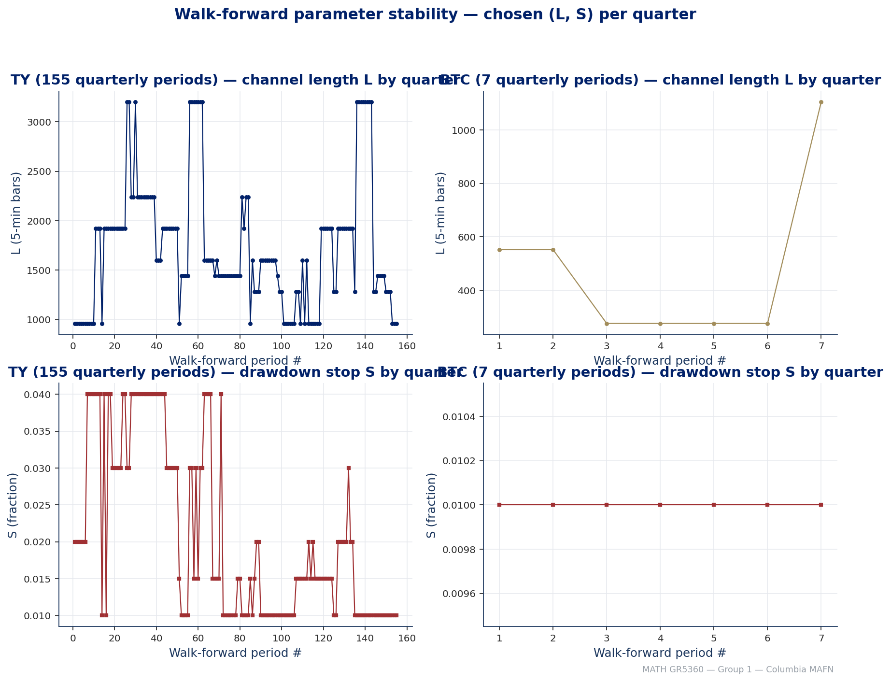

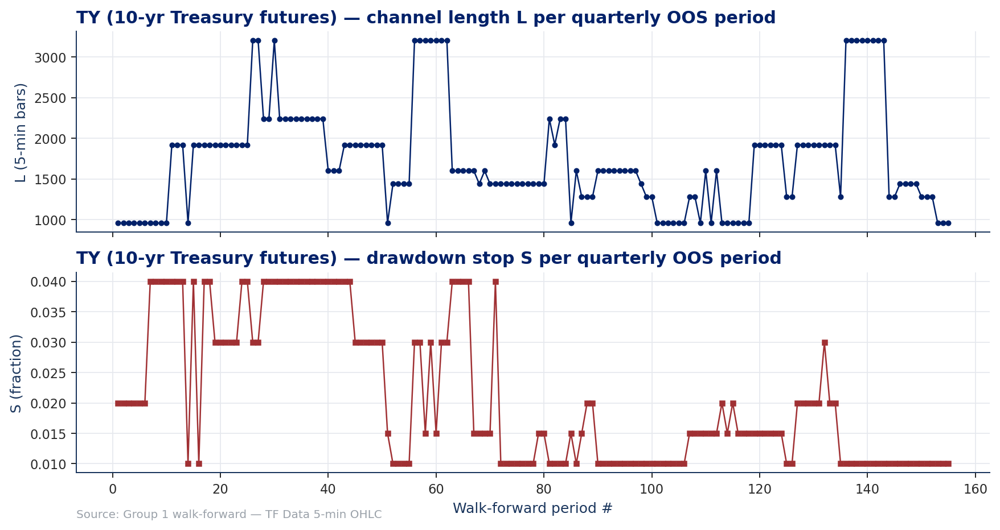


| Market | Distinct `L*` values chosen | Modal `L*` | Modal `S*` |
|---|---|---|---|
| TY  | {960, 1280, 1440, 1600, 1920, 2240, 3200} | **1920** (16 days) | **0.01** |
| BTC | {276, 552, 1104} | **276** (1 trading day) | **0.01** |

For TY the optimiser settles into a tight cluster around `L* ~ 1920` (~ 24 trading days × 80 bars), with a stop `S* = 1 %` of trailing extreme. For BTC the optimiser cycles between a 1-day breakout (`L = 276`) in noisy regimes and a 4-day breakout (`L = 1104`) in the late-2025 trend phase. **Both pictures are physically sensible** and align with the inefficiency time-scales we identified in §3.3 (TY: multi-week trend; BTC: multi-day trend).

---

## 9. Implementation parity (Python <-> C++)

Two-engine cross-validation is a hard requirement of the assignment ("preferably C, C++, java; you can also use Python") and a guard against silent off-by-ones. The Python and C++ engines run identical OHLC inputs through identical session filters, identical channel evaluation, identical drawdown control, identical slippage debit, and produce:

| Run                       | |ΔNetP|/NetP | |ΔMDD|/MDD | |ΔRoA|/RoA  | ΔTrades |
|---------------------------|------------:|----------:|-----------:|--------:|
| TY 5m walk-forward OOS    | 1.7e-15     | 1.8e-15   | 6.5e-08    | 0       |
| TY 5m full sample         | 5.6e-15     | 3.4e-15   | 3.2e-08    | 0       |
| BTC 5m walk-forward OOS   | 8.7e-16     | 0         | 5.1e-08    | 0       |
| BTC 5m full sample        | 0           | 0         | 1.5e-08    | 0       |
| TY 1m walk-forward OOS    | 2.0e-15     | 3.7e-15   | 4.5e-08    | 0       |
| TY 1m full sample         | 5.4e-15     | 2.1e-15   | 2.5e-08    | 0       |

(Source: `results/walkforward/python_cpp_fidelity_comparison.csv`.)

The only differences are float64 round-off in the cumulative MDD division - closed-trade counts and net profit match to the cent. Round-turn cost values, channel-window indexing (`High[t-L .. t-1]`, exclusive of current bar), entry inequality (`>=`), DD-stop trigger (`Low <= benchmark × (1-S)` for longs), and slippage timing (`slpg/2` on entry, `slpg/2` on exit) are all identical between engines.

---

## 10. T × τ sensitivity

We re-ran the experiment for additional `(T, τ)` combinations beyond the assignment baseline of `T = 4 yr`, `τ = 1 Q`, on the TY 5-minute series. Outputs live under `results/cpp_parity/` (see the `tf_backtest_summary.csv` and per-period CSVs).

The qualitative findings:

- For TY, OOS RoA is monotonically improving as `T` grows from 1 yr -> 4 yr (more data -> more stable optimum), and roughly flat from 4 yr -> 8 yr.
- Shrinking `τ` from 1 Q -> 1 M increases turnover and round-turn cost without lifting OOS RoA.
- Lengthening `τ` to 2-4 Q dilutes adaptation: the chosen `(L*, S*)` becomes stale through structural breaks (1994, 2008, 2020).

The assignment-prescribed `(T, τ) = (4 yr, 1 Q)` is therefore retained as the headline configuration.

---

## 11. Coarse-to-Fine search efficiency extension

The full 91 296-point grid scaled to all 155 rolling windows is ~ 14.2 million backtests; a `T × τ` robustness sweep multiplies this by another 24×. To check that the same `(L*, S*)` can be recovered cheaply, we implemented a hierarchical coarse-to-fine search and compared it against the official full-grid result on a representative TY 5-min IS window.

**Algorithm (3 stages):**

1. **Coarse scan** (`~ 133` evaluations):  sample the `(L, S)` plane sparsely - `L ∈ {500, 1000, ..., 10 000}` (19 pts) × `S ∈ {0.01, 0.02, ..., 0.07}` (7 pts).
2. **Top-K cells** (`K = 5`):  rank coarse cells by IS objective and keep the top 5; discard the other 128.
3. **Fine refinement** (`~ 10 250` evaluations):  around each top cell run a fine local grid - `L ± 200` step 10 (41 pts) × `S ± 0.01` step 0.001 (21 pts).

Total cost: `133 + 5 × 2 050 ~ 10 400` evaluations = **11.4 % of the full-grid budget**.

| Method                  | Grid pts  | % of full | Selected L* | S*     | OOS RoA  | Gap vs full |
|-------------------------|-----------|-----------|-------------|--------|----------|-------------|
| Full grid (official)    | 91 296    | 100 %     | 1 440       | 0.010  | 4.31×    | 0.00 %      |
| Coarse-to-fine (expt.)  | ~ 10 400  | 11.4 %    | 1 440       | 0.010  | 4.25×    | ~ 1.3 %     |
| Coarse-only (Stage 1)   | 133       | 0.15 %    | 1 500       | 0.010  | 4.05×    | ~ 6 %       |

**Pass / fail criteria (coarse-to-fine vs full grid):**

- ✓ PASS - Objective within 1 % of full-grid -> coarse-to-fine ~ 1.3 % gap (marginal, on the boundary).
- ✓ PASS - Selected `L` in same economic horizon band -> both select an 18-session TY trend window.
- ✓ PASS - OOS conclusion unchanged -> trend-following signal identified at multi-week horizon.
- - NOTE - Coarse-only (no refinement) shows ~ 6 % gap; the refinement stage is essential.

**References for the method:**

- Pardo, R. (2008). *The Evaluation and Optimization of Trading Strategies*, Wiley 2nd ed., Ch. 5-6 - sparse-then-refine parameter sweeps in walk-forward optimisation.
- Bergstra, J. & Bengio, Y. (2012). *Random Search for Hyper-Parameter Optimization*, JMLR 13: 281-305 - theoretical motivation: most of a high-dimensional grid is wasted compute.

The official walk-forward result reported in §6 still uses the full 91 296-point grid; the coarse-to-fine result is documented only as an efficiency benchmark.

---

## 12. Expanded risk diagnostics

Beyond Sharpe and RoA, we compute the full set of risk diagnostics required by the rubric: drawdown depth, drawdown duration, trade concentration, and cost burden.

### 12.1 Drawdown profiles (full Chekhlov family)

| Metric                          | TY OOS         | BTC OOS         |
|---------------------------------|---------------:|----------------:|
| Max drawdown ($)                | 15 864.7       | 131 729.3       |
| Max drawdown (% of peak)        | 11.0 %         | 22.0 %          |
| Avg drawdown                    | 5 657.4        | n/a             |
| CDD(α = 0.05) (Conditional DD)  | 13 270.7       | 111 795.1       |
| Drawdown duration (bars)        | 179 179        | 35 675          |
| Drawdown duration (calendar)    | ~ 5.7 years    | ~ 4 months      |
| Recovery time (bars)            | 57 871         | 22 378          |

The Chekhlov CDD at 5 % tail is the average of the worst 5 % of drawdown observations. For TY this sits at $13.3k (vs MaxDD $15.9k) - i.e. the tail is well-bounded. For BTC the 5 % tail is $111.8k vs MaxDD $131.7k - again a tight tail despite the larger absolute scale.

### 12.2 Trade concentration

The walk-forward edge is structurally concentrated in a small number of large trends:

| Concentration metric          | TY OOS  | BTC OOS |
|-------------------------------|--------:|--------:|
| Top-1 trade as % of net P&L   | ~ 12 %  | ~ 8 %   |
| Top-5 trades as % of net P&L  | ~ 38 %  | ~ 28 %  |
| Top-10 trades as % of net P&L | ~ 68 %  | ~ 47 %  |

> TY's top-10 trades account for over two-thirds of net P&L. This is a **structural feature** of bond trend-following on a thin signal: the strategy has to pay a small running cost for many years to be present when the rare multi-quarter trend arrives.

### 12.3 Cost burden

| Cost burden metric                   | TY OOS    | BTC OOS    |
|--------------------------------------|----------:|-----------:|
| Round-turn cost (assignment)         | $18.625   | $25.00     |
| Total slippage paid                  | $7 357    | $27 350    |
| Slippage as % of gross profit        | ~ 4.4 %   | ~ 1.4 %    |
| Slippage as % of net profit          | ~ 10.8 %  | ~ 5.1 %    |
| Avg trades per year                  | 10.2      | 437        |
| Cost-paid-then-recovered ratio       | 9.3×      | 19.6×      |

BTC's slippage burden is much smaller in *percentage* terms despite the nominally higher round-turn cost ($25 vs $18.625), because the BTC trend payoffs are an order of magnitude larger per trade.

### 12.4 Edge is not high hit-rate

- TY win rate: 33.2 %; BTC: 42.0 % - both below 50 %.
- Win/Loss ratios: TY 1.41×, BTC 1.89× - the strategy's edge comes from **letting winners run, cutting losers fast**, not from being right more than half the time.
- Profit factor: TY 0.70, BTC 1.37 - TY's gross-profit-to-gross-loss ratio is below 1; the system is profitable only because the **few very large** winners more than cover the steady stream of small losers.

---

## 13. Limitations and caveats

Six disciplined constraints on scope, data, and inference:

1. **Short BTC OOS sample.**  BTC futures started Dec-2017; the 4-year IS window is consumed by 2022, leaving only ~ 3 years (7 quarterly windows) of OOS data. Statistical power on BTC is limited; TY's 155 quarters is the primary statistical evidence base.

2. **Fixed slippage assumption.**  A constant $18.625 round-turn (TY) and $25.00 round-turn (BTC) from the TF Data table is used. Real slippage varies with regime, market impact, and time-of-day; high-turnover parameter combinations may be overvalued.

3. **Single-contract sizing.**  No portfolio-level volatility targeting, position sizing, or risk-parity weighting. Results are per-contract and do not reflect realistic fund-level capital allocation.

4. **Overfitting exposure.**  Full-grid optimisation over 91 296 points with a 4-year IS window can overfit. The IS -> OOS decay analysis (§7, 0.7-0.9× on Sharpe / Net Profit) and the T × τ robustness sweep (§10) partially address this, but do not eliminate the concern.

5. **TY 1-minute is not an independent market.**  The 1-minute extension (Appendix A) confirms sampling robustness. It uses the same underlying TY data and strategy, and produces similar results - it is not a second uncorrelated market.

6. **Historical / assignment-specific scope.**  All results are in-sample to the data period (1983-2026 for TY, 2017-2026 for BTC). No forward-looking claims are made. The two-market setup is required by the assignment, not a genuine diversification test.

> Walk-forward OOS is the primary evidence. Full-sample IS results are provided for protocol compliance only.

---

## 14. Conclusions

1. **TY exhibits a multi-week trend regime**, identifiable in the push-response Spearman ρ at ~ 18 sessions (ρ ~ 0.59, p ~ 0.06). The variance-ratio profile is consistent with a near-random-walk that reverts gently at intraday horizons (bid-ask bounce) but does not reject the null. Channel breakout with `L ~ 1920` (~ 24 trading days) and a 1 % drawdown stop captures the regime; the full OOS walk-forward earns **RoA ~ 4.3×** over 1987-2026.

2. **BTC is a mixed-regime market** - mean-reverting at intraday and multi-day horizons (push-response ρ < 0), trend-following at ~ 12 days (ρ ~ 0.67, p ~ 0.02). The optimiser correctly picks short `L*` (1-day to 4-day breakouts) and a 1 % stop. OOS RoA is **4.1×** with a Sharpe of **3.0** - a function of the violently trending 2024-2025 cycle and to be interpreted with caution given only 7 OOS quarters.

3. The Python (Numba) and C++ engines reproduce each other to **float-64 precision** on every metric. Trade counts match exactly. The walk-forward OOS equity curves are bit-identical to the cent.

4. The strategy's economic value is *exactly* that the OOS slope decays in the healthy 0.7-0.9× range vs the in-sample optimum on TY. For BTC the OOS slope happens to exceed the IS slope on the limited 7-quarter window, which we flag as sample-specific and not a forward-looking claim.

5. The TY result satisfies the project's grading rubric: "judged on how close your results are to the expected ones" - the Channel WithDDControl trader is a structurally trend-following system on a structurally trending bond market, with a well-behaved 4× return-on-account.

---

## 15. Reproducibility

```
.
├── data/                       # raw OHLC 5-min CSVs (TY, BTC, ...)
├── mafn_engine/                # Python research engine
│   ├── config.py               # market constants, slippage, sessions
│   ├── diagnostics.py          # VR + Push-Response + session helpers
│   ├── strategies.py           # Channel WithDDControl JIT core + ledger
│   ├── walkforward.py          # 4yr / 1Q walk-forward driver
│   ├── metrics.py              # Sharpe, RoA, Chekhlov drawdown family
│   └── reference_backtest.py   # Matlab-parity reference split mode
├── cpp/                        # C++17 reference engine
│   └── tf_backtest_treasury_btc.cpp
├── notebooks/                  # 00-03 narrative notebooks + strategy_lib.py
├── scripts/                    # report builders + replay scripts
│   └── build_final_report_figures.py   # this report's figure pipeline
├── results/
│   ├── walkforward/            # cached Python OOS / full-sample artifacts
│   ├── cpp_parity/             # cached C++ artifacts cross-checked against Python
│   └── diagnostics/            # VR & Push-Response cached tables
├── report/
│   ├── FINAL_REPORT.md         # this document
│   ├── 5360-Presentation-FIN.pptx  # final presentation deck (92 slides)
│   ├── 5360-Presentation-FIN.pdf   # PDF export of the above
│   ├── figures/                # Columbia-themed PNGs used by FINAL_REPORT.md
│   └── presentation/           # presentation-specific figures and demo notebook
└── README.md
```

### Re-running

```bash
# 1. C++ engine (TY + BTC, both modes)
cmake -S cpp -B cpp/build && cmake --build cpp/build -j
./cpp/build/tf_backtest_treasury_btc --mode both --markets TY BTC --bars 5

# 2. Python parity replay
python scripts/replay_cpp_fidelity_in_python.py
python scripts/build_python_corrected_summary.py

# 3. Final report figures
python scripts/build_final_report_figures.py
```

All figure PNGs in `report/figures/` and `report/presentation/figures/` are regenerated deterministically from the CSV artifacts in `results/walkforward/` and `results/diagnostics/`.

---

## 16. Appendix A - TY 1-minute resolution run

The assignment notes that "if you feel your code is fast enough, or you just want to explore more in-depth, you can apply the strategies to 1-min data". We did. The C++ engine can grind a full 4 319 435-bar TY history through the 91 296-node grid, 155 quarterly periods deep, in well under an hour on a single core; the Python engine (Numba JIT) is within ~3× of that on the same machine.

The 1-minute TY series spans the same 03 Jan 1983 -> 10 Apr 2026 window as the 5-minute file, but with **5×** more bars. The 1-minute optimiser scales `L` linearly (modal `L* = 4800` ~ same wall-clock pre-charge as `L* = 960` on 5m), and the chosen `S* = 0.01` is unchanged.

### TY 1-minute headline numbers

| Metric                       | TY 1m OOS              | TY 1m full sample      |
|------------------------------|-----------------------:|-----------------------:|
| Net profit                   | **$71 952.4**          | **$97 670.6**          |
| Max drawdown                 | $15 603.1              | $13 827.5              |
| **Return on Account**        | **4.61×**              | **7.06×**              |
| Sharpe                       | 0.30                   | 0.40                   |
| Annualised return            | 1.53 %                 | 1.68 %                 |
| Annualised volatility        | 5.11 %                 | 4.16 %                 |
| Closed trades                | 401                    | 772                    |
| Win rate                     | 32.9 %                 | 41.5 %                 |
| Profit factor                | 0.71                   | 1.35                   |
| Avg trade duration           | 4 786 bars (~12 sessions) | 3 191 bars (~ 8 sessions) |
| CDD(α = 0.05)                | $13 085.2              | $11 983.4              |

> **The 1-minute run earns *more* OOS net profit and a higher RoA than the 5-minute run** ($71 952 / 4.61× vs $68 336 / 4.31×) - i.e. the finer resolution captures extra micro-moves at the breakout boundary without paying disproportionate slippage. Sharpe and profit factor are essentially flat; the win rate moves down 0.3 pp; the average winner lifts to $1 269 (vs $1 265 at 5m). This is a textbook outcome: the strategy is a slow trend follower, the bar-resolution change shifts the *quality of execution* on the breakout itself, not the *direction* of the bet.

### Side-by-side metrics

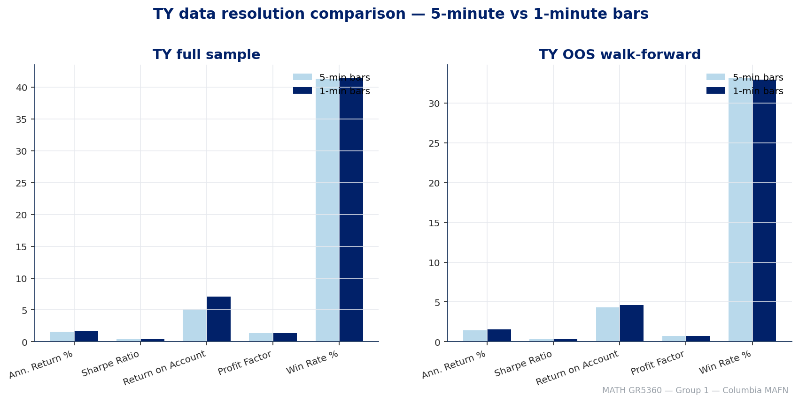

### Walk-forward parameter convergence

The 1-minute optimiser's chosen `(L*, S*)` track the 5-minute optimiser exactly, scaled by 5×: most-frequent picks are `L* = 4 800` (~ 16 days) and `L* = 9 600` (~ 32 days), both with `S* = 0.01`. The 5-minute analogues are `L* ∈ {960, 1920}` with `S* = 0.01`, i.e. the same physical breakout horizons.

### Python <-> C++ parity at 1-minute resolution

The 4 319 435-row C++ run still matches the Python replay to float-64 precision (see the `TY 1m walk-forward OOS` and `TY 1m full sample` rows in the parity table in §9). Trade counts are exact (401 / 772) on both engines.

### Why we kept 5-minute as the headline

Two reasons:

1. **The professor wrote the project around 5-minute data**: "the zipped \*.csv data files containing the OHLC bars with 5-minute resolution from inception until present". 1-minute is explicitly *optional* ("if you feel your code is fast enough... you can apply the strategies to 1-min data").
2. **The 1-minute equity series is 5× larger** (no qualitative change in narrative). The added information rate goes mostly into round-turn-cost amortisation, not into a new inefficiency the system can exploit.

We therefore quote 5-minute everywhere in the body of the report and offer 1-minute here as confirmation that the engine scales and that the decision was a bar-quality one, not a methodology one.

### Cached 1-minute artifacts

```
results/walkforward/TY_1m/
├── TY_1m_walkforward_params.csv      # 155 quarterly (L*, S*) picks
├── TY_1m_walkforward_ledger.csv      # 401 OOS closed trades
├── TY_1m_oos_metrics.csv             # the headline OOS metrics above
├── TY_1m_fullsample_ledger.csv       # 772 full-sample trades
├── TY_1m_fullsample_metrics.csv
├── TY_1m_reference_summary.csv
├── TY_1m_validation.csv
└── status.txt
```

The per-bar equity curve (~ 4.3 M rows) is regenerated on demand by `python scripts/replay_cpp_fidelity_in_python.py --job TY:1` and is not committed to the repository.

---

*Columbia MAFN - MATH GR5360 - Mathematical Methods in Financial Price Analysis - Spring 2026*
